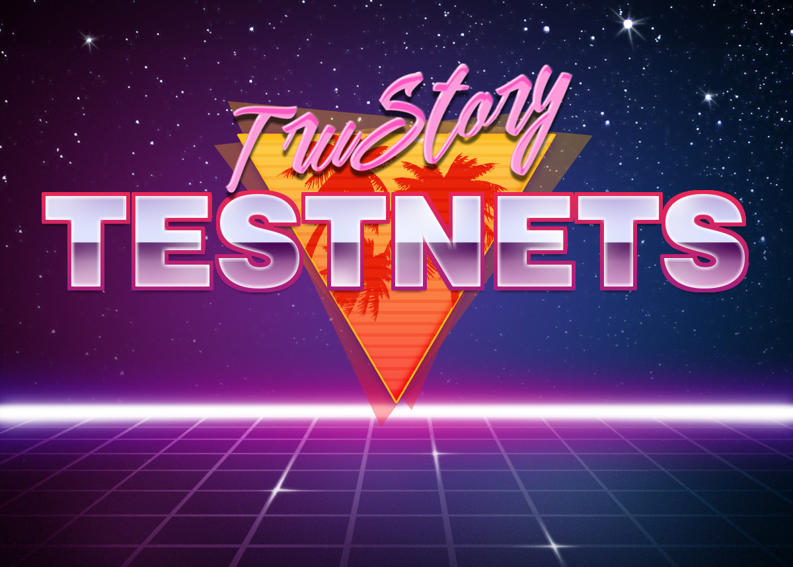

# ⚠️ Testnet-1 Update

**Genesis transaction submission: Nov 22nd 5pm PST (0100 GMT)**

**Genesis file availability:      Nov 25th 10am PST (1800 GMT)**

**Genesis start time:             Nov 26th 9am PST (1700 GMT)**


Please update your binaries to the latest release [v0.4.2-beta](https://github.com/TruStory/truchain/releases/tag/v0.4.2-beta):
```
$ wget https://github.com/TruStory/truchain/releases/download/v0.4.2-beta/truchain-v0.4.2-beta.tar.gz
$ mkdir -p ~/bin && tar xzvf truchain-v0.4.2-beta.tar.gz -C ~/bin
```

After the genesis availability date, download the genesis file to your chain config directory:
```
$ wget -O .truchaind/config/genesis.json https://raw.githubusercontent.com/TruStory/testnets/master/testnet-1/genesis.json
```

Verify the checksum:
```
$ sha256sum .truchaind/config/genesis.json
c1034a2e41a8028ccbcd476f5ca617ba5a069960e671c69a2ae47f9ad086bb99 genesis.json
```

Before the genesis start time, start your chain:
```
$ truchaind start --p2p.persistent_peers "c86fe442b5febdd2539d322af83d9c55f57d57fd@13.52.13.214:26656"
```
Better yet, start it [as a service](https://github.com/TruStory/testnets/blob/master/linux.md#make-a-system-service-optional).

If all goes well, all validators will start producing blocks at the genesis start time.

## Overview

TruStory testnets will test the functionality of the [TruStory blockchain](https://github.com/TruStory/truchain) prior to the launch of mainnet. Validators who plan on joining the mainnet launch are strongly encouraged to participate in testnets.

To join a testnet, you must submit a [genesis transaction](https://github.com/TruStory/testnets#create-genesis-transaction) that creates your validator on the TruStory blockchain.

## How to run a validator on testnet

The latest testnet is [testnet-1](https://github.com/TruStory/testnets/tree/master/testnet-1).

### [Linux Setup](./linux.md)

### Install TruChain

Download Linux binaries:
```sh
$ wget https://github.com/TruStory/truchain/releases/download/v0.4.1-beta/truchain-v0.4.2-beta.tar.gz
$ mkdir -p ~/bin && tar xzvf truchain-v0.4.2-beta.tar.gz -C ~/bin
```

Alternatively, build from source:
```sh
$ git clone https://github.com/trustory/truchain
$ cd truchain && git checkout v0.4.2-beta
$ make install
```

Make sure you have the right version:
```sh
$ truchaind version --long
name: truchain
server_name: truchaind
client_name: truchaincli
version: v0.4.2-beta
commit: 42cb4328b2b25dcb94db53fa53de5097cc6a07d2
go: go version go1.13.1 linux/amd64
```

Please build from source for non-Linux systems for now.

For full instructions, see [https://github.com/TruStory/truchain](https://github.com/TruStory/truchain).

### Create a wallet

```sh
# <name> is the name of your validator's account, i.e: validator
$ truchaincli keys add <name>
```
Make sure you save the mnemonic in a safe place!

### Create genesis transaction

```sh
# <moniker> is the name of your validator node
$ truchaind init --chain-id=testnet-1 <moniker>

# <name> is the name of validator's account (from above)
$ truchaind add-genesis-account $(truchaincli keys show <name> -a) 10000000000utru

# <node_ip_address> is the public IP address of your node
$ truchaind gentx --name <name> --amount 10000000000utru --ip <node_ip_address>
```

This generates a JSON file that contains the chain transaction that creates your validator with an allocation of 10,000 TRU. 
For example, check out the genesis transaction for [blockshane](https://github.com/TruStory/testnets/blob/master/testnet-1/gentx/gentx-267f9165a57da281721c3cf58adfeb9d506b7777.json). 

_The JSON in this example has been formatted to be human readable. It doesn't have to be formatted, but feel free to use a tool like [jq](https://stedolan.github.io/jq/) if you'd like to format yours as well._

### Submit genesis transaction

Submit a pull request with your gentx file added to the [testnet-1/gentx](https://github.com/TruStory/testnets/tree/master/testnet-1/gentx) directory.

Click "Fork" on top-right corner of page. Navigate to your fork, then:

```sh
# create a local clone
$ git clone https://github.com/<your-username>/testnets

# configure remote repo for your fork
$ cd testnets
$ git remote add upstream https://github.com/TruStory/testnets

# create a local branch
$ git checkout --branch <your-branch>

# copy over gentx file
$ cp ~/.truchaind/config/gentx/*.json testnet-1/gentx

# add changes to git
$ git add . && git commit -m "Added gentx for <your-validator-moniker>"

# push your branch
$ git push origin
```

[Submit a pull request](https://help.github.com/en/github/collaborating-with-issues-and-pull-requests/creating-a-pull-request-from-a-fork) to get your genesis transaction added.

## Next Steps

Await further instructions on joining the testnet when it launches.
